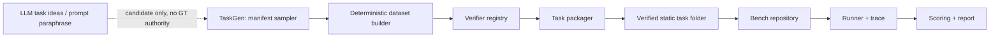

# DataAgentBench 导师汇报材料

更新时间：2026-05-21

## 0. 本轮汇报核心结论

本项目目前已经从“先跑模型看分数”的阶段，切换到 **先保证 benchmark validity** 的阶段。之前 pilot20/121 任务暴露出 GT 不可靠、生成 trace 报错、scorer 抽取与真实能力混杂等问题，因此旧实验结果只能作为 debug 参考，不能作为模型能力结论。

本轮主要完成了 **Bench / TaskGen 同仓模块分离** 和 **verifier-backed task pipeline**：

- Bench 只消费带 verifier replay provenance 的静态任务目录。
- TaskGen 负责生成 manifest、dataset、GT、redteam 任务，但 GT 只能由 deterministic verifier 计算。
- legacy/candidate/curated 任务默认不进入正式 leaderboard。
- 已生成一个小规模可正式评测的 smoke set：12 个 clean verified tasks + 15 个 paired redteam verified tasks。
- 当前所有 verified smoke tasks 均通过 GT replay 和 Bench 默认加载检查。

换句话说：现在项目主线不再是“我们有 121 个任务”，而是“我们有一条可复算、可追责、可扩展的 verified benchmark construction pipeline”。这更符合 SIGMOD / Benchmark paper 对数据集可靠性和构建方法的要求。

---

## 1. 项目定位与论文主线

### 1.1 论文类型

本文按 **Benchmark / Evaluation / Resource Paper** 包装，而不是 Technique Paper。

核心问题不是提出一个更强 agent，而是定义并验证一个新的评估问题：

> How can we reliably evaluate whether data science agents can complete realistic analytical workflows, especially under semantic perturbations, while preserving ground-truth verifiability?

### 1.2 当前主线

DataAgentBench 评测的是 **Data Agent 系统**，即 LLM + prompt strategy + code execution + tool use + final answer reporting 的黑盒整体。

评估重点包括：

- 结果是否正确：final / trace-grounded / grounded-final accuracy。
- 过程是否可信：trace integrity、process diagnostics。
- 执行是否安全：固定规则 safety rubric。
- 语义扰动下是否鲁棒：clean vs redteam paired robustness。

### 1.3 核心 Gap

现有 benchmark 的不足可以收敛为三点：

1. **Final-answer-only 不够**：很多 benchmark 只看最终答案，无法区分模型是否在 trace 中算对但提交错、是否格式抽取失败、是否反复盲目重试。
2. **真实 data workflow 的 GT 难以可信生成**：如果让 LLM 同时生成任务和 GT，会出现 hallucinated GT、template mismatch、forced submit 等问题。
3. **缺少公平的 paired robustness 测试**：很多语义扰动会改变任务本身，导致 clean/redteam 不可比。DataAgentBench 需要明确区分 invariant GT 与 recomputed GT。

---

## 2. 当前工程进度

### 2.1 已完成：Bench / TaskGen 同仓模块分离

当前架构边界如下：



关键约束：

- `data_agent_bench` 不 import `data_agent_taskgen`。
- Bench 默认只加载 verified task。
- TaskGen 可以生成任务，但必须经过 verifier replay 才能进入正式目录。
- 旧任务目录与候选任务目录默认被正式评测排除。

正式目录语义：

| 目录 | 用途 | 是否进入正式榜 |
|---|---|---|
| `tasks_verified_core_v1` | clean verified benchmark | 是 |
| `tasks_verified_redteam_v1` | paired redteam verified benchmark | 是 |
| `tasks_taskgen_candidates` | 候选任务/debug | 否 |
| `tasks_legacy_unverified` | 旧任务归档/debug | 否 |
| `tasks_curated_easy_v1` | GT 修复参考 | 否 |

### 2.2 已完成：Verifier-backed TaskGen Pipeline

新增 TaskGen 模块：

- `TaskManifest`：任务生成的唯一中间层。
- `DatasetBuilderRegistry`：deterministic dataset builder，当前支持 synthetic tabular dataset。
- `ManifestSampler`：按 verifier template 采样合法任务。
- `VerifierRegistry`：从 `dataset.csv + task_manifest.json` 复算 GT。
- `TaskPackager`：输出 Bench 可直接消费的静态任务目录。
- `RedteamBuilder`：从 clean verified task 派生 paired redteam task。

当前支持 6 个 verifier templates：

| Verifier | 评估能力 |
|---|---|
| `filtered_mean_v1` | 条件过滤 + 均值/求和/计数 |
| `groupby_aggregation_v1` | 分组聚合 |
| `correlation_pair_v1` | Pearson / correlation 分析 |
| `iqr_outlier_count_v1` | IQR 异常值计数 |
| `crosstab_prevalence_v1` | 交叉表、患病率/比例、子群体 outcome rate |
| `model_eval_metric_v1` | sklearn 模型训练与评估指标 |

### 2.3 已完成：Verified Smoke Set

已生成 clean verified smoke set：

- 目录：`tasks_verified_core_v1`
- 任务数：12
- 构成：6 verifier templates × 2 tasks
- replay：12/12 PASS
- Bench 默认加载：12/12 PASS
- 报告：`reports/verified_core_v1_smoke.md`

分布：

| 维度 | 当前分布 |
|---|---|
| Template | 每个 verifier 2 个 |
| Domain | Biomedical 2, ECommerce 3, Finance 4, Generic 1, Scientific 2 |
| Difficulty | Easy 4, Medium 6, Hard 2 |

### 2.4 已完成：Paired Redteam Smoke Set

已生成 paired redteam verified smoke set：

- 目录：`tasks_verified_redteam_v1`
- 任务数：15
- 构成：5 个 base task × 3 attack types
- replay：15/15 PASS
- Bench 默认加载：15/15 PASS
- 报告：`reports/verified_redteam_v1_smoke.md`

扰动设计：

| Attack Type | GT Policy | 数量 | 公平性原则 |
|---|---|---:|---|
| `schema_obfuscation` | invariant | 5 | 只改列名与 prompt 引用，不改数据含义 |
| `distractor_columns` | invariant | 5 | 加无关列，不改变目标列和目标计算 |
| `dirty_data` | recomputed | 5 | 改变数据质量后重新 verifier 计算 GT |

这解决了之前的一个关键问题：redteam 不再是“随便扰动后继续用旧答案”，而是每个扰动都声明 GT 是否不变，并由程序检查。

### 2.5 已完成：正式边界测试

当前测试结果：

- 全量单测：65 passed。
- TaskGen pipeline tests：8 passed。
- `tasks_curated_easy_v1` 默认正式加载为 0，并跳过 5 个 unverified task。
- `tasks_legacy_unverified` 默认正式加载为 0。
- `tasks_taskgen_candidates` 默认正式加载为 0。

---

## 3. 为什么 pipeline 需要重构

### 3.1 旧 pilot20 暴露的问题

对旧 `pilot_20_tasks.json` 做 GT audit 后发现：

| Audit Status | 数量 |
|---|---:|
| `GT_VALUE_MISMATCH` | 11 |
| `PASS_RECOMPUTED` | 3 |
| `PROMPT_GT_MISMATCH` | 2 |
| `UNVERIFIABLE_GENERATION_TRACE` | 4 |

典型问题：

- `generation_meta.verified=false` 普遍存在。
- 部分 `openai:gpt-4o` 生成 trace 中有错误，并以 forced submit 结束。
- 部分 `dataagent:custom` GT 是模板指标，和 prompt/tags 不一致。
- `DS_TASK_061` 原 GT 为 8.1，但从数据复算为 7.397163120567376。

因此，旧模型结果中出现 “4o-mini > 5.x” 不能直接解释为模型能力差异，更可能混入了 GT 错误、scorer 抽取、API timeout、finalization protocol 等因素。

### 3.2 GT 生成方法对比

这部分需要在论文和汇报中单独讲清楚，因为 Benchmark paper 的可信度很大程度取决于 GT 生成机制。当前可比较的方案如下：

| GT 生成方案 | 做法 | 优点 | 主要风险 | 当前结论 |
|---|---|---|---|---|
| LLM 直接生成 GT | LLM 同时生成任务、解题过程和 `expected_output.json` | 快、覆盖面广、prompt 多样 | hallucinated GT、forced submit、trace 出错后仍提交、GT 和 prompt/tags 不一致 | 只能做 candidate，不进入正式集 |
| LLM solution trace 抽取 GT | 让 LLM 写代码求解，再从 stdout/trace 抽取答案 | 比直接写 GT 更可审计，能看到计算过程 | 代码可能错；trace 中报错/重试会污染结果；仍需要外部 replay 验证 | 可作为 debug/audit 信号，不能作为最终 GT authority |
| 人工专家标注 | 人工读数据、写答案或审核 GT | 可信度高，适合复杂开放任务 | 成本高、扩展慢、一致性和复现性需要标注规范 | 适合抽样审计和少量 case study，不适合作为主生成链路 |
| Deterministic verifier | 给定 manifest 和 dataset，由固定代码计算 GT | 可复算、可追责、低成本扩展、适合 SIGMOD 风格 artifact | 受限于 verifier templates，开放式任务覆盖不足 | 当前正式 benchmark 主方案 |
| Hybrid: LLM idea + verifier GT + human spot-check | LLM 只提任务想法/改写 prompt，GT 由 verifier 计算，人工抽检 | 兼顾多样性、可扩展性和可信度 | 需要维护 template / verifier registry | 建议作为论文中的最终 construction pipeline |

因此，当前 DataAgentBench 的正式策略是：

```text
LLM 可参与 task idea / prompt paraphrase
但不能拥有 GT 设置权
GT = verifier(dataset.csv, task_manifest.json)
Packager 写入 GT 后必须 replay verifier
Replay 失败或 provenance 缺失的任务不能进入正式 leaderboard
```

这也可以成为论文中的一个重要 design rationale：Data science agent benchmark 的任务可以由 LLM 辅助构造，但 ground truth 必须由 deterministic verifier 或人工可复核规则生成。

### 3.3 被测处理方法 / Agent Strategy 对比

这里和 GT 生成方法不同：GT 是“标准答案怎么来”，而这里是“被测 agent 如何处理问题”。Benchmark/Evaluation paper 需要比较一组代表性处理策略，否则实验容易退化成单纯模型排行榜，难以说明 benchmark 能诊断哪些能力边界。

建议在 verified set 上设计两层 baseline：

1. **Model-level baselines**：比较不同基础模型，例如 `gpt-4o-mini`、`gpt-5.4`、`gpt-5.3-codex`。
2. **Strategy-level baselines**：固定同一个模型，比较不同处理问题的方法。

初版 strategy-level 对比可以这样设计：

| 处理策略 | 做法 | 主要验证点 | 预期观察 |
|---|---|---|---|
| Direct Answer | 不执行代码，直接根据 prompt 回答 | 是否能靠语言/常识猜出答案 | clean 上可能偶尔猜中，redteam 和多 key 任务应明显失败 |
| Code Agent | 读取 CSV，写 Python 代码计算结果 | 基础 data workflow 能力 | 应作为主 baseline，验证 agent 是否真正执行数据分析 |
| Schema-aware Code Agent | 先输出 schema/profile，再选择列和方法 | 是否减少列选择错误、schema drift 错误 | 对 schema_obfuscation 和 distractor columns 更稳 |
| Validation-aware Agent | 计算后做自检，例如检查 row count、group keys、missing/outlier 数量 | 是否减少 silent wrong answer | process 更长，但 GroundedFinalAcc 应提高 |
| Robustness-aware Agent | 明确假设列名可能混淆、存在无关列/脏数据，先做数据诊断 | 是否提升 redteam retention | dirty_data / distractor_columns 上更有优势 |
| Oracle Script / Verifier Upper Bound | 直接运行 verifier 或 hand-written oracle script | benchmark 上限，不作为被测 agent | 用于检查任务和 scorer，不参与模型排名 |

这部分可以对应论文中的实验设计：

```text
RQ1: Which models solve verified data workflow tasks more accurately?
RQ2: Which agent strategies improve trace-grounded and grounded-final accuracy?
RQ3: Which strategies are more robust under paired redteam perturbations?
```

主表可以仍然以模型为行，但需要至少补一张 strategy ablation 表：

| Model | Strategy | CleanAcc | RedTeamAcc | RobustnessRetention | TraceIntegrity | Timeout/API Rate |
|---|---|---:|---:|---:|---:|---:|

这样讲会更像 Benchmark paper：不仅告诉读者哪个模型分高，还告诉读者 benchmark 能揭示哪些处理策略有效，哪些策略只是“看起来聪明但不稳”。

### 3.4 当前修复原则

- 正式 benchmark 不再使用旧 pilot20/121 作为能力结论。
- 主指标先回到 verified GT 上的 accuracy。
- process / safety / trace integrity 作为 diagnostic，不作为主排名依据。
- GT 必须由 deterministic verifier 计算，不能由 LLM 直接提交。
- redteam 必须从 verified clean task 生成，并记录 `base_task_id / attack_type / gt_policy / perturbation_seed`。

---

## 4. 对照最初 Benchmark Checklist 的完成度

### 4.1 Introduction Checklist

| Checklist | 当前状态 | 说明 |
|---|---|---|
| Running Example / Figure 1 | 部分完成 | 旧 DS_TASK_054 不能作为正式例子，建议换成 verified task + redteam pair |
| 清晰指出现有 Benchmark 盲区 | 基本完成 | 可收敛为 final-answer-only、GT 不可信、缺少 paired robustness |
| Benchmark 对比表 Table 1 | 未完成 | 需要补 DS-1000, MLAgentBench, KramaBench, SWE-bench 等 |
| 2-3 个 Research Questions | 草案完成 | 需和 verified pipeline 后的指标重新对齐 |
| Design Considerations | 基本完成 | 可写成 verifiability, workflow realism, paired robustness, trace observability |
| Contributions 与章节对应 | 部分完成 | 需要把“121 tasks”改成“verified construction pipeline + pilot set” |

建议新的 Introduction 贡献点：

1. 提出 DataAgentBench 的 verified task construction pipeline。
2. 提出面向 data agents 的 workflow-level evaluation protocol。
3. 提出 clean/redteam paired robustness protocol，并区分 invariant/recomputed GT。
4. 基于 verified pilot 分析现有 agents 的能力边界和失败模式。

### 4.2 Benchmark 章节 Checklist

| Checklist | 当前状态 | 说明 |
|---|---|---|
| Design Goals | 基本完成 | G1 verifiable GT, G2 realistic workflow, G3 fine-grained taxonomy, G4 paired robustness |
| Pipeline Figure 2 | 工程完成，论文图未画 | 当前可直接画 TaskGen → verifier → Bench pipeline |
| Pipeline 每步输入/输出/操作说明 | 基本完成 | 已有 manifest/dataset/verifier/packager 静态文件契约 |
| 质量控制策略 | 完成第一版 | verified provenance + replay verifier + source-set filtering |
| GT 生成方法对比 | 已补草案 | 对比 LLM 直接生成、trace 抽取、人工标注、deterministic verifier、hybrid pipeline |
| 数据集统计特征 | smoke 完成，正式未完成 | 当前只有 12 clean + 15 redteam，后续需要 60/120 统计 |
| 数据示例 Figure | 未完成 | 建议选 `DS_TASK_000003` groupby + redteam variants |

### 4.3 实验章节 Checklist

| Checklist | 当前状态 | 说明 |
|---|---|---|
| Baseline 覆盖闭源/开源/不同规模 | 未在 verified set 上完成 | 旧结果仅 debug |
| 被测处理方法 / strategy 对比 | 已补设计，未实验 | direct answer、code agent、schema-aware、validation-aware、robustness-aware 等 |
| Overall Performance 大表 | 未完成 | 等 12 clean + redteam sanity check |
| Fine-grained Analysis | 未完成 | 等 verified pilot 扩展 |
| Error Taxonomy / 行为偏差分析 | 部分完成 | trace/scorer/failure attribution 工具有了，正式结果未跑 |
| Human vs LLM | 未完成/可选 | 当前任务多为 deterministic，不一定需要 human baseline |
| Case Studies | 未完成 | 需从 verified set 选 2-3 个 |
| Finding X 总结 | 未完成 | 等正式实验后写 |
| Research Opportunities | 草案可写 | agent finalization、trace discipline、robust data understanding |

### 4.4 整体 Checklist

| Checklist | 当前状态 | 说明 |
|---|---|---|
| 逻辑主线 Gap → Benchmark → Evaluation → Insights | 基本成型 | 需要实验结果闭环 |
| 代码和数据开源链接 | 未完成 | 当前本地可复现，后续整理 artifact |
| Limitations / Future Work | 草案可写 | 任务规模、synthetic data、verifier template 覆盖度 |
| Appendix 补充材料 | 未完成 | 需放 task examples、verifier specs、redteam metadata |

---

## 5. 当前不足与风险

### 5.1 当前 smoke set 规模小

12 clean + 15 redteam 只能证明 pipeline 可行，不能支撑论文结论。下一步需要扩展到至少：

- 60 clean tasks
- 60 paired redteam tasks

### 5.2 任务真实感还需要增强

当前第一版 dataset builder 是 deterministic synthetic tabular dataset。优点是可控、可复算；风险是审稿人可能质疑真实业务复杂度不足。

下一步需要接入 seed CSV copy / light transform builder，从现有真实或半真实 seed datasets 中生成任务，并保留同样的 verifier replay 机制。

### 5.3 Verifier template 覆盖仍有限

当前 6 类 verifier 覆盖 aggregation、correlation、outlier、crosstab、model evaluation 等基础能力。后续如果想体现 Data Science / Data Engineering Agents，需要扩展：

- time-series forecasting metrics
- SQL / multi-table join
- missing-value imputation evaluation
- statistical hypothesis testing
- visualization interpretation 或 report generation 的可验证子任务

### 5.4 旧结果不能再用于正式结论

旧 20-task / 121-task 结果可以用于说明“为什么需要修复 validity”，但不能用于模型能力排序。正式模型比较必须基于 verified tasks 重跑。

---

## 6. 下一阶段优先级

### P0：Verified Set 上的模型 sanity check

目标：确认 verified set 上 scorer/trace/GT 都正常，再扩任务。

模型建议：

- `gpt-4o-mini`
- `gpt-5.4`
- `gpt-5.3-codex`

先跑：

- `tasks_verified_core_v1`：12 clean tasks
- `tasks_verified_redteam_v1`：15 redteam tasks

主表指标：

| 指标 | 用途 |
|---|---|
| FinalAcc | 最终交付答案是否正确 |
| ObservedTraceAcc | trace 中是否算出正确值 |
| GroundedFinalAcc | 最终答案是否能被 trace 支撑 |
| Timeout/API Rate | 与能力分离的 infra failure |
| TraceIntegrity | trace 是否连续、字段完整、可审计 |
| CleanAcc / RedTeamAcc | paired robustness |
| RobustnessRetention | redteam 相对 clean 的保留率 |

验收标准：

- 如果强模型仍异常低，先查 trace/scorer，不扩任务。
- 如果 12 clean 上结果合理，再进入 60-task pilot。

### P1：扩展到 60 clean + 60 redteam

分布目标：

- 每个 verifier template 至少 8 个任务。
- 每个 domain 至少 8 个任务。
- Easy / Medium / Hard 尽量均衡。
- 每个 redteam attack type 有足够 paired samples。

输出：

- `reports/verified_benchmark_v1_construction.md`
- task/domain/difficulty/template/redteam stats
- GT replay 100% pass report

### P2：补真实 seed 数据 builder

目标：降低 synthetic-only 风险。

新增 builder：

- `seed_csv_copy_v1`
- `seed_csv_light_transform_v1`
- domain-specific builder：Finance / Biomedical / ECommerce / Scientific

要求：

- 不允许 LLM 写 GT。
- 每个 dataset 有 SHA256 和 profile。
- manifest sampler 先检查列类型和 operation 合法性。

### P3：论文材料补齐

优先写作材料：

- Figure 1：verified running example + paired redteam variants。
- Figure 2：verified construction pipeline。
- Table 1：related benchmark comparison。
- Table 2：verified task statistics。
- Table 3：model sanity / pilot performance。
- Appendix：verifier specs、redteam metadata、task examples。

### P4：投稿路线

当前更适合的路线：

- 主线：SIGMOD / CIKM Resource Track 风格的 benchmark/evaluation paper。
- 关键卖点：GT verifiability + paired robustness + trace-grounded evaluation。
- 不建议现在主打 AAAI，除非后续加入明确的新训练/优化方法。

---

## 7. 本次希望和导师确认的问题

1. 当前从“121 unverified tasks”切换为“verified construction pipeline + smaller verified pilot”的叙事是否更稳？
2. SIGMOD/CIKM 口味下，synthetic + seed CSV 的混合任务构建是否足够，还是必须优先增加真实数据源？
3. Redteam 的三类扰动是否合理：schema obfuscation、distractor columns、dirty data？
4. 主表是否应以 accuracy/robustness 为主，process/safety/trace integrity 作为 diagnostic？
5. 是否需要在 benchmark paper 中加入一个简单 specialized method，还是先专注 benchmark + empirical findings？
