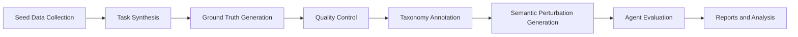
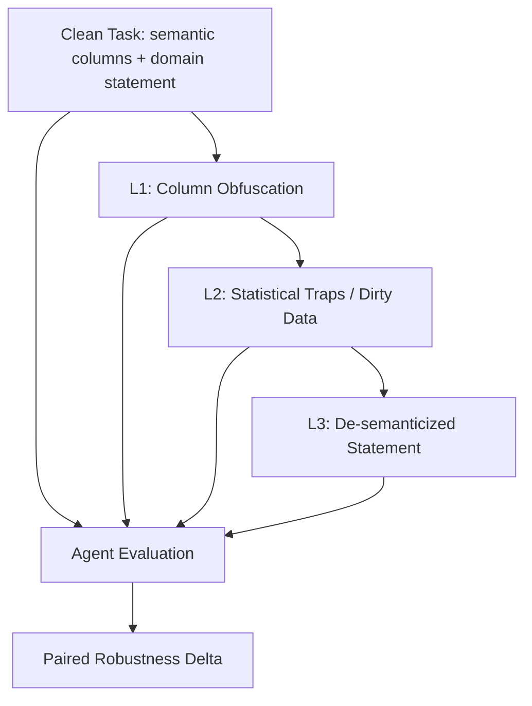

# DataAgentBench 导师汇报：项目进度、Checklist 对照与优先级 Todo

**汇报日期**：2026-05-18  
**目标方向**：Benchmark / Evaluation Paper  
**目标 venue**：SIGMOD 2027 Research Track, E&A / Benchmarks and Datasets  
**核心主线**：评估 data agents 在真实数据分析 workflow 中的可靠性，尤其是面对 schema、metadata、业务语义扰动时的鲁棒性。

---

## 0. 汇报摘要

DataAgentBench 当前已经具备 benchmark paper 的基本骨架：已有 **121 个数据分析任务**、**5 个领域**、**3 个难度等级**、可运行的 evaluation framework，以及 GPT-4o-mini 在 clean setting 下的全量初步结果。项目也已经形成了清晰的论文主线：现有 agent/data benchmark 无法系统评估 data agents 在真实数据工作流中的可靠性，尤其无法衡量 agent 对 column names、schema metadata 和 task semantics 的依赖。

但距离 SIGMOD 可投版本，核心差距还在实验闭环：目前只有单模型 clean baseline，尚未完成多模型、多扰动、paired robustness、fine-grained analysis、case study 和 artifact reproduction。因此下一阶段重点不是继续扩写模板，而是补齐 **Pipeline + Evidence + Checklist** 三件事。

---

# Part I. 项目进度与当前基础

## 1. 论文定位

### 1.1 Benchmark Paper，而不是 Technique Paper

本项目不主打“提出一个新的 agent 方法”，而是主打“定义一个新的评估维度并提供系统评估基础设施”。

| 类型 | 叙事主轴 | DataAgentBench 应采用哪种 |
|---|---|---|
| Technique Paper | Problem -> New Method -> Better Results | 不作为主线 |
| Benchmark / Evaluation Paper | Evaluation Gap -> Benchmark Design -> Evaluation Framework -> Empirical Findings -> Research Opportunities | 主线 |

### 1.2 当前一句话问题定义

> We study the problem of evaluating whether data science agents can reliably complete realistic analytical workflows under schema, metadata, and semantic perturbations, considering not only final-answer accuracy but also process quality, safety, cost, and robustness.

中文表达：

> 我们研究如何评估 data science agents 是否能在真实数据分析 workflow 中可靠工作，尤其是在 schema、metadata 和语义线索被扰动时，是否仍能保持正确性、过程质量、安全性和成本效率。

---

## 2. 当前 Research Gap 与 Motivation

建议将全文 gap 压缩为 3 点，避免太散。

### Gap 1: Workflow Reliability Blind Spot

现有 benchmark 多关注最终答案、代码生成或单步推理，无法评估 data agent 作为完整 workflow executor 的可靠性。

DataAgentBench 对应设计：

- result accuracy
- process quality
- safety score
- token/cost efficiency
- component accuracy

### Gap 2: Schema / Metadata Semantic Robustness Blind Spot

很多 data agents 强依赖可读列名、领域描述和业务语义线索。现有 benchmark 默认 schema 和 task statement 是语义清晰的，无法判断 agent 是真正理解数据，还是依赖语义捷径。

DataAgentBench 对应设计：

- Clean 原始任务
- L1 column obfuscation
- L2 statistical traps / dirty data perturbation
- L3 de-semanticized task statement
- clean-vs-perturbed paired robustness

### Gap 3: Diagnostic Evaluation Blind Spot

现有 benchmark 往往只能告诉我们模型“对或错”，但不能诊断错因。Data agent 的失败可能来自数据选择、预处理、方法选择、数值计算、解释或格式输出。

DataAgentBench 对应设计：

- primary task type
- secondary task types
- challenge dimensions
- component-level accuracy
- failure attribution / error taxonomy

---

## 3. 当前 Benchmark 资产

### 3.1 任务规模

当前任务库包含 **121 个 realistic analytical tasks**。

| Domain | Tasks |
|---|---:|
| Finance | 29 |
| Biomedical | 27 |
| Scientific | 27 |
| ECommerce | 25 |
| Generic | 13 |

| Difficulty | Tasks |
|---|---:|
| Easy | 40 |
| Medium | 41 |
| Hard | 40 |

### 3.2 任务类型体系

已设计 7 类 primary task types，同时支持 secondary task types 和 challenge dimensions。

| Slug | 中文 |
|---|---|
| `descriptive_aggregation` | 描述统计与聚合分析 |
| `statistical_inference` | 统计推断与假设检验 |
| `time_series_forecasting` | 时间序列与预测分析 |
| `predictive_modeling` | 预测建模与模型评估 |
| `risk_anomaly_decision` | 异常、风险与决策分析 |
| `data_quality_robustness` | 数据质量与鲁棒性处理 |
| `specialized_domain_analysis` | 专业领域分析方法 |

### 3.3 Running Example

已选定 `DS_TASK_054` 作为贯穿全文的 Running Example。

| 字段 | 内容 |
|---|---|
| Domain | Finance |
| Difficulty | Easy |
| Primary Task Type | 时间序列与预测分析 |
| Secondary Task Types | 描述统计与聚合分析；数据质量与鲁棒性处理 |
| Challenge Dimensions | heteroskedasticity, outlier handling, semantic perturbation |
| Clean Columns | `Date`, `Price`, `TradeVolume` |
| L1 Mapping | `Date -> var_d36f`, `Price -> var_fbca`, `TradeVolume -> var_69e1` |
| Ground Truth | `average_price = 104.56994551077256` |

这个例子后续应承担 Figure 1 的作用：让审稿人快速理解为什么 semantic perturbation 能暴露 data agent 的可靠性问题。

---

## 4. 当前 Evaluation Framework

当前评测对象是完整 **Data Agent 系统**，即 LLM + prompting strategy + tool execution + code-writing behavior + final answer。

### 4.1 已有指标

| Metric | 含义 |
|---|---|
| `completion_rate` | agent 是否完成关键步骤和最终提交 |
| `result_accuracy` | 最终数值/结构化答案是否接近 ground truth |
| `process_quality` | 工具使用、错误恢复、冗余操作、执行过程质量 |
| `safety_score` | 是否避免危险命令和资源滥用 |
| `token_efficiency` | token 使用效率 |
| `total_cost_usd` | API 成本 |

### 4.2 CAS 综合指标

当前 Composite Agent Score：

```text
CAS = 0.40 * result_accuracy
    + 0.35 * process_quality
    + 0.25 * safety_score
```

后续论文中建议：主表报告单项指标，CAS 作为综合摘要或辅助指标，避免 reviewer 质疑权重主观。

### 4.3 Component Accuracy

已设计 component-level accuracy，用于诊断综合型任务失败原因。

| Component | 含义 | 默认权重 |
|---|---|---:|
| `data_selection` | 是否选对列、过滤条件、分组对象 | 0.15 |
| `preprocessing` | 是否正确处理缺失、异常、类型转换 | 0.10 |
| `method_selection` | 是否选对统计方法或模型 | 0.10 |
| `numerical_result` | 最终数值是否接近 ground truth | 0.55 |
| `interpretation` | 结论解释是否与结果一致 | 0.05 |
| `output_format` | 是否按要求输出结构化答案 | 0.05 |

---

## 5. 当前 Baseline 结果

目前已有 **GPT-4o-mini 在 121 个 clean tasks 上的全量结果**。

| Metric | Mean | Median | Min | Max |
|---|---:|---:|---:|---:|
| Completion Rate | 0.7005 | 0.7015 | 0.1069 | 1.0000 |
| Result Accuracy | 0.3901 | 0.4056 | 0.0021 | 1.0000 |
| Process Quality | 0.3862 | 0.3783 | 0.0952 | 0.8333 |
| Safety Score | 0.9008 | 1.0000 | 0.7000 | 1.0000 |
| Total Tokens | 15303.25 | 16117 | 414 | 73128 |
| Cost USD | 0.0042 | 0.0035 | 0.0000 | 0.0316 |

初步观察：

- GPT-4o-mini 能完成相当一部分流程，但最终 accuracy 仍明显不足。
- process quality 较低，说明 agent 仍存在冗余操作、诊断不足或执行纪律不强的问题。
- safety score 较高，当前瓶颈主要不是安全，而是分析正确性、过程质量和鲁棒性。
- 这些结果只能作为初步 signal，尚不能支撑最终 paper findings。

---

## 6. Benchmark Construction Pipeline 规划

这部分是 benchmark paper 的核心，后续应作为 Section 2 的主体，并画成 Figure 2。



### 6.1 Pipeline 逐步说明

| Step | Input | Operation | Output | 当前状态 |
|---|---|---|---|---|
| Seed Data Collection | public / curated datasets | 选择 finance、biomedical、scientific、e-commerce 等领域数据 | seed tables | 部分完成 |
| Task Synthesis | seed tables + task templates / LLM generation | 生成 problem statement、expert knowledge、task metadata | candidate tasks | 已有 121 tasks |
| Ground Truth Generation | candidate tasks + reference code | 执行参考解法，记录 key values / alternative values | `expected_output.json` | 已有基础，需增强验证 |
| Quality Control | task + data + GT | schema validation、execution validation、sanity checks、manual audit | validated tasks | schema 有，人工审核不足 |
| Taxonomy Annotation | task metadata + problem statement | 标注 primary/secondary/challenge | enriched task metadata | schema 有，全量 annotation 待完成 |
| Semantic Perturbation Generation | clean task | L1 列名混淆、L2 数据陷阱、L3 去语义化 | matched task variants | 方案有，实验未完成 |
| Agent Evaluation | task variants + agent | 统一运行、记录 trace、计算 metrics | `report.json` | clean GPT-4o-mini 已完成 |
| Reports and Analysis | reports + metadata | overall、fine-grained、robustness、case study | paper tables/figures | 待补齐 |

### 6.2 Perturbation Pipeline



| Level | 目的 | 示例 |
|---|---|---|
| Clean | 原始任务，保留自然语义 | `Date`, `Price`, `TradeVolume` |
| L1 | 测试列名语义依赖 | `Date -> var_d36f`, `Price -> var_fbca` |
| L2 | 测试脏数据和统计陷阱鲁棒性 | 异常值、类型混淆、伪相关列、schema drift |
| L3 | 测试去语义化后的分析能力 | 去掉 finance/e-commerce/biomedical 等业务描述 |

---

## 7. 论文结构规划

建议 SIGMOD 版本采用以下结构。

| Section | 内容 | 当前状态 |
|---|---|---|
| 1 Introduction | gap、running example、RQ、contributions | 有草案，需写成正式版 |
| 2 The Proposed Benchmark | design goals、task scope、construction pipeline、characteristics | 框架有，缺 Figure 2 和统计图 |
| 3 Evaluation Framework | metrics、CAS、component accuracy、robustness protocol | 设计基本完成 |
| 4 Experiments & Findings | setup、overall、fine-grained、robustness、case studies | 最薄弱，需要补实验 |
| 5 Discussion & Research Opportunities | 研究机会、局限、未来方向 | 有方向，缺 findings 支撑 |
| 6 Related Work | benchmark 对比、agent benchmark、data benchmark | 缺 Table 1 和具体文献 |
| 7 Conclusion | 总结贡献和发现 | 待写 |

---

# Part II. Checklist 对照与完成度

## 8. Benchmark 五大核心要素完成度

| 核心要素 | 要求 | 当前完成度 | 状态判断 |
|---|---|---:|---|
| Research Gap | 明确现有评估盲区和 motivation | 60% | 有三类 gap，但需要 Table 1 和 related work 支撑 |
| Construction Pipeline | 可扩展、高质量、低成本的数据构建流程 | 50% | 有任务和代码基础，但 pipeline、QC、GT validation 还不完整 |
| Evaluation Framework | 多维指标、taxonomy、诊断能力 | 70% | 指标设计较完整，component annotation 尚未全量落地 |
| Empirical Findings | 多角度实验洞察和 Finding X | 25% | 只有单模型 clean baseline，缺多模型和扰动结果 |
| Optional Method | 可选优化方法或专门 baseline | 10% | 暂无，不建议作为 R3 主线 |

整体判断：**Framework 成熟度高于 Evidence 成熟度**。下一步应优先补实验证据，而不是继续扩展概念。

---

## 9. Introduction Checklist

| Checklist | 状态 | 完成度 | 说明 |
|---|---|---:|---|
| 是否有精心设计的 Running Example / Figure 1 | 部分完成 | 50% | 已选 `DS_TASK_054`，但 Figure 1 未画，L2/L3 未落地 |
| 是否清晰指出现有 Benchmark 的关键盲区，不超过 3 点 | 部分完成 | 70% | 已压缩成 3 个 gap，但需更 SIGMOD 化 |
| 是否提供 Benchmark 对比表 Table 1 | 未完成 | 20% | 只有比较维度，缺具体 benchmark |
| 是否明确列出 2-3 个 Research Questions | 已完成初稿 | 80% | RQ1/RQ2/RQ3 已有 |
| 是否阐述 Design Considerations | 部分完成 | 60% | 需要写成 G1-G5 |
| 贡献点是否与 RQ 和章节结构对应 | 部分完成 | 60% | 前 3 点成立，第 4 点 empirical findings 需实验支撑 |

### Introduction 当前最缺

- Figure 1。
- Table 1。
- 正式 Introduction v1。
- Contributions 中不要承诺还没完成的实验结论。

---

## 10. Benchmark 章节 Checklist

| Checklist | 状态 | 完成度 | 说明 |
|---|---|---:|---|
| 是否有清晰的 Design Goals | 部分完成 | 60% | 建议采用 G1-G5 |
| 是否有完整 Pipeline 流程图 Figure 2 | 未完成 | 30% | 本文档已有草图，需做论文版 |
| Pipeline 每一步是否有输入、输出和操作说明 | 部分完成 | 55% | 表格已有，需精炼进论文 |
| 是否详细描述质量控制策略 | 部分完成 | 45% | schema validation 有，人工审核和 GT validation 弱 |
| 是否展示丰富的数据集统计特征 | 部分完成 | 45% | domain/difficulty 有，task type/challenge/dataset size 需生成 |
| 是否提供完整数据示例 | 部分完成 | 50% | `DS_TASK_054` 可用，但需做 Figure |

### Benchmark 章节当前最缺

- Figure 2 pipeline。
- Design Goals 正式描述。
- Quality Control 方案。
- Task statistics charts。
- Full task example。

---

## 11. 实验章节 Checklist

| Checklist | 状态 | 完成度 | 说明 |
|---|---|---:|---|
| Baseline 是否覆盖开源/闭源、不同规模模型 | 未完成 | 20% | 目前只有 GPT-4o-mini clean |
| 是否有 Overall Performance 大表格 | 未完成 | 25% | 单模型 clean 表已有，多模型表缺 |
| 是否有多维度 Fine-grained Analysis | 未完成 | 25% | 需要 domain/difficulty/task-type/challenge/component |
| 是否有 Error Taxonomy 或行为偏差分析 | 未完成 | 20% | 需要从 traces 标注 |
| 是否有人类基线 | 可选 | 0% | 不一定需要，除非证明任务可解性 |
| 是否有 Case Studies | 部分完成 | 30% | 已选 Running Example，缺真实 case narrative |
| 是否提炼 Finding X | 未完成 | 20% | 目前是预期 findings，不是实验 findings |
| 是否讨论 Research Opportunities | 部分完成 | 40% | 方向有，缺 findings 支撑 |

### 实验章节当前最缺

- 3-model baseline。
- Clean/L1/L2/L3 paired robustness。
- Overall Performance 大表。
- Fine-grained Analysis。
- Case Studies。
- Finding X。

---

## 12. 整体 Checklist

| Checklist | 状态 | 完成度 | 说明 |
|---|---|---:|---|
| 全文是否有清晰逻辑主线：Gap -> Benchmark -> Evaluation -> Insights -> Opportunities | 部分完成 | 60% | 前三段有，Insights/Opportunities 还弱 |
| 是否开源代码和数据并提供链接 | 未完成 | 30% | repo 有，但匿名 artifact 未整理 |
| 是否有 Limitations and Future Work | 未完成 | 20% | 可写，但应基于最终实验 |
| Appendix 是否包含充分补充材料 | 未完成 | 20% | 需要 full task list、prompt、更多结果、GT validation |

---

## 13. 当前完成度总览

| 模块 | 完成度 | 风险 |
|---|---:|---|
| Paper Positioning | 75% | 需要更 SIGMOD 化 |
| Research Gap / Motivation | 60% | 需要 related work 支撑 |
| Benchmark Assets | 70% | 任务已有，annotation 和 QC 不完整 |
| Evaluation Framework | 70% | 指标有，component 使用不足 |
| Running Example | 50% | 缺 Figure 1 和真实扰动案例 |
| Construction Pipeline | 50% | 缺论文级 Figure 2 和质量控制 |
| Baseline Experiments | 25% | 只有 GPT-4o-mini clean |
| Robustness Experiments | 15% | 主贡献还未实证 |
| Empirical Findings | 25% | 还停留在预期 findings |
| Artifact / Reproducibility | 30% | 需要匿名 repo 和 quick-start |

---

# Part III. 优先级 Todo List

## P0：必须马上做，否则主线撑不起来

| 优先级 | Todo | 目的 | 预计产出 |
|---|---|---|---|
| P0-1 | 完成 Figure 1: `DS_TASK_054` Clean/L1/L2/L3 | 让 Running Example 成为全文锚点 | Figure 1 草图 + caption |
| P0-2 | 写正式 Introduction v1 | 固化 Gap -> Benchmark -> RQ -> Contributions | 1.5 页 intro |
| P0-3 | 完成 Table 1 Benchmark Comparison | 证明 gap 不是自说自话 | related benchmark 对比表 |
| P0-4 | 写 G1-G5 Design Goals | 让 benchmark 设计有原则 | Section 2.1 草稿 |
| P0-5 | 画 Figure 2 Construction Pipeline | Benchmark 论文核心图 | pipeline 图 + step table |
| P0-6 | 固化 L1/L2/L3 perturbation protocol | 支撑主贡献 semantic robustness | protocol 文档 |

## P1：实验闭环，决定论文能不能投

| 优先级 | Todo | 目的 | 预计产出 |
|---|---|---|---|
| P1-1 | 选 60 个 core tasks | 降低 R3 实验成本，保证覆盖 | core task list |
| P1-2 | 跑 20-task pilot: Clean/L1/L2/L3 | 先验证 pipeline 是否稳定 | pilot robustness table |
| P1-3 | 跑至少 3 个 baseline | 支撑 “current data agents” 结论 | GPT-4o-mini / GPT-4o / Claude or Gemini |
| P1-4 | 生成 Overall Performance 大表 | 实验主表 | Table 3 |
| P1-5 | 做 clean vs L1/L2/L3 paired delta | 支撑 semantic robustness finding | robustness figure |
| P1-6 | 做 Wilcoxon test + effect size | 增强统计说服力 | significance table |

## P2：Fine-grained Analysis 和 Case Study

| 优先级 | Todo | 目的 | 预计产出 |
|---|---|---|---|
| P2-1 | 完成 121 tasks taxonomy annotation | 支撑 task-type analysis | taxonomy metadata |
| P2-2 | 生成 domain/difficulty/task-type/challenge 统计 | Benchmark characteristics | Table 2 / Figure |
| P2-3 | 给 20-30 个核心任务补 component labels | 支撑 component accuracy | component scoring subset |
| P2-4 | 做 error taxonomy / failure attribution | 解释为什么失败 | error taxonomy table |
| P2-5 | 写 2-3 个 Case Studies | 让 findings 可读可信 | case study subsection |
| P2-6 | 提炼 Finding 1-4 | Benchmark 论文标志性写法 | findings boxes |

## P3：Artifact 与投稿包装

| 优先级 | Todo | 目的 | 预计产出 |
|---|---|---|---|
| P3-1 | 整理 anonymous artifact repo | 满足 SIGMOD benchmark 要求 | 匿名仓库 |
| P3-2 | 准备 quick-start subset | 方便 reviewer 复现 | small subset run script |
| P3-3 | 写 dataset card / model card / evaluation card | 提升可信度 | artifact docs |
| P3-4 | 写 limitations and ethics | 完整论文必要部分 | Section 5/Appendix |
| P3-5 | 准备 appendix | 放 full task list、prompt、更多结果 | appendix materials |
| P3-6 | 做 R3/R4 决策 | 控制投稿风险 | 投稿策略 |

---

## 14. 推荐执行顺序

### 未来 48 小时

1. Figure 1。
2. Introduction v1。
3. Table 1。
4. Figure 2 草图。
5. Design Goals。

### 未来 1 周

1. 选 60 core tasks。
2. 固化 perturbation protocol。
3. 跑 20-task pilot。
4. 生成 Table 2。
5. 完成 taxonomy annotation 初版。

### 未来 2-4 周

1. 跑 3-model main experiment。
2. 生成 overall performance 和 robustness figure。
3. 做 fine-grained analysis。
4. 写 case studies。
5. 整理 artifact quick-start。

---

## 15. 给导师的最终汇报口径

当前 DataAgentBench 已经具备 benchmark paper 的基本基础：任务库、评测框架、初步结果和论文主线都有了。但按照 Benchmark/Evaluation 论文 checklist 来看，最大短板是 empirical evidence：目前还没有完成多模型、多扰动和 paired robustness 实验，因此还不能充分支撑 semantic robustness 这一核心贡献。

下一阶段我建议按三个优先级推进：

1. **先补论文骨架**：Introduction、Figure 1、Table 1、Figure 2、Design Goals。
2. **再补实验闭环**：3 models × 60 core tasks × Clean/L1/L2/L3。
3. **最后补投稿材料**：case studies、findings、artifact、limitations、appendix。

如果 6 月中旬前能完成 P0 和 P1，SIGMOD R3 可以尝试；如果 P1 实验结果不完整，则建议把 R3 作为 internal deadline，正式冲 SIGMOD R4。

